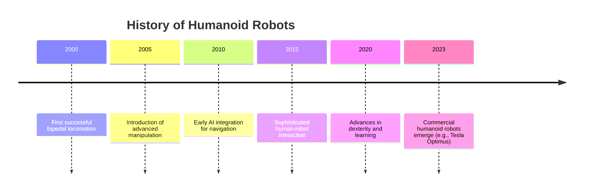

# Quickstart: Structuring Topic Overview Page

**Date**: 2025-12-21
**Feature**: [Topic Overview Content](E:\speckit\course_book\specs\002-intro-content\spec.md)

## Overview

This guide explains how to create and structure the `docs/topic-overview.md` page. It details the required front matter, content sections, word count, and the inclusion of visual aids like a Mermaid timeline and a robot comparison table.

## Prerequisites

*   A Docusaurus project set up with the classic preset.
*   The `docs/topic-overview.md` file exists or is created.
*   Familiarity with Markdown syntax, including headings, lists, tables, and Mermaid code blocks.

## Steps to Structure `docs/topic-overview.md`

### 1. Define YAML Front Matter

At the beginning of the `docs/topic-overview.md` file, add the following YAML front matter:

```yaml
---
id: topic-overview
title: "Topic Overview"
sidebar_label: "Topic Overview"
---
```

### 2. Structure the Markdown Content

Organize the content using Markdown headings (`#`, `##`, `###`) and elements as outlined below.

#### Welcome

Add a brief introductory sentence or paragraph to welcome readers to the topic overview.

#### Overview (Approx. 900-1200 words)

Write a comprehensive overview section explaining Physical AI and humanoid robots in general. Cover their broad scope and significance. This section should be detailed and informative, aiming for the 900-1200 word count.

#### Differences from Traditional AI

Dedicate a section to explaining how Physical AI and humanoid robots differ from traditional, non-embodied AI systems. Discuss aspects like embodiment, real-world interaction, and sensory input.

#### History of Humanoid Robots

Include a section tracing the historical development of humanoid robots. Mention key milestones and examples like Shakey the robot and significant advancements leading to modern robots (e.g., Boston Dynamics' Atlas, Tesla's Optimus).

#### Why Humanoids?

Explain the rationale behind developing humanoid robots. Discuss their advantages and the unique challenges they present compared to other robot forms.

#### Industry Leaders

Discuss key industry players in humanoid robotics, specifically mentioning Tesla and Boston Dynamics.

#### Applications

Outline current and potential applications of humanoid robots, providing examples in areas such as home assistance and healthcare.

#### Timeline of Humanoid Robotics

Embed a Mermaid timeline to illustrate the historical progression of humanoid robotics.


*Note: Placeholder data used; actual historical data will be populated during content creation.*

#### Robot Comparison Table

Include a Markdown table for comparing different humanoid robots or AI systems.

```markdown
| Robot/System | Manufacturer | Key Features | Application Area | Year Introduced/Significant Update |
|--------------|--------------|--------------|------------------|-----------------------------------|
| Optimus      | Tesla        | TBD          | TBD              | TBD                               |
| Atlas        | Boston Dynamics | TBD          | TBD              | TBD                               |
| ASIMO        | Honda        | TBD          | TBD              | TBD                               |
| ...          | ...          | ...          | ...              | ...                               |
```
*Note: Placeholder data used; specific robot data should be researched and filled.*

#### Future Outlook

Conclude with a section discussing the projected future developments, potential breakthroughs, and societal impacts of Physical AI and humanoid robots.

### 3. Review and Commit

Ensure all sections are complete, Markdown is correctly formatted, and visual aids render properly. Commit the changes to the `002-intro-content` branch.

This structured approach ensures the `docs/topic-overview.md` page is comprehensive, informative, and meets all specified requirements.
